# pow3r.cashout - User Workflow Architecture Diagram

## Node-Based Workflow Architecture

```mermaid
graph TB
    %% Entry Points
    A[👤 User Login] --> B{🔐 Authentication}
    B -->|Success| C[📊 Dashboard Overview]
    B -->|Fail| A
    
    %% Dashboard Overview Hub
    C --> D[🎯 API Agent Workflows]
    C --> E[🎨 UI Agent Workflows]
    C --> F[📚 Component Library]
    C --> G[🔍 Universal Search]
    
    %% API Agent Workflows (Blue Theme)
    D --> D1[🔄 Flow Modification<br/>• Design automated workflows<br/>• Node-based flow editor<br/>• Trigger/action configuration<br/>• Workflow templates]
    D --> D2[💬 Message Review<br/>• AI message processing<br/>• Auto-response generation<br/>• Template management<br/>• Lead qualification]
    D --> D3[📋 Project Management<br/>• Multi-step project tracking<br/>• Resource allocation<br/>• Timeline management<br/>• Progress monitoring]
    
    %% UI Agent Workflows (Purple Theme)
    E --> E1[📝 Phase 1: Content & Setup<br/>• Item details collection<br/>• Photo processing<br/>• Price research<br/>• Content generation<br/>• Platform selection<br/>• Posting strategy]
    E --> E2[🤖 Phase 2: Automation<br/>• Auto-posting engine<br/>• Lead monitoring<br/>• Negotiation management<br/>• Sale processing<br/>• Analytics dashboard]
    E --> E3[➕ New Post Flow<br/>• Step-by-step wizard<br/>• AI content generation<br/>• Multi-platform posting<br/>• Image processing<br/>• Garage management]
    E --> E4[🧩 Component Library<br/>• UI component showcase<br/>• Design system browser<br/>• Component testing<br/>• Theme management]
    
    %% Workflow Interconnections
    D1 -->|Triggers| D2
    D1 -->|Manages| D3
    D2 -->|Feeds| E2
    D3 -->|Coordinates| E1
    D3 -->|Coordinates| E2
    
    E1 -->|Prepares| E2
    E1 -->|Feeds| E3
    E2 -->|Monitors| E3
    E3 -->|Stores| E4
    
    %% Cross-Platform Integration Points
    E1 --> H[🌐 Platform APIs<br/>• Facebook Marketplace<br/>• OfferUp<br/>• Craigslist<br/>• eBay<br/>• Amazon<br/>• Social Media APIs]
    E2 --> H
    E3 --> H
    
    %% AI/ML Processing Layer
    D2 --> I[🧠 AI Processing<br/>• Abacus Deep Agent<br/>• Content generation<br/>• Price optimization<br/>• Lead scoring<br/>• Response templates]
    E1 --> I
    E2 --> I
    E3 --> I
    
    %% Data Storage Layer
    D1 --> J[💾 Data Layer<br/>• Workflow definitions<br/>• Execution history<br/>• User preferences<br/>• Template storage]
    D2 --> J
    D3 --> J
    E1 --> J
    E2 --> J
    E3 --> J
    
    %% Analytics & Monitoring
    C --> K[📈 Analytics Hub<br/>• Performance metrics<br/>• User behavior<br/>• Workflow success rates<br/>• Revenue tracking]
    D1 --> K
    D2 --> K
    D3 --> K
    E1 --> K
    E2 --> K
    E3 --> K
    
    %% User Journey Paths
    C -->|New User| L[🚀 Onboarding Flow<br/>• Welcome wizard<br/>• Platform setup<br/>• First listing creation<br/>• Auto-responder setup]
    L --> E1
    
    C -->|Returning User| M[⚡ Quick Actions<br/>• Create new listing<br/>• Review leads<br/>• Update responses<br/>• Schedule posts]
    M --> E3
    M --> E2
    
    C -->|Power User| N[🔧 Advanced Features<br/>• Custom workflows<br/>• Bulk operations<br/>• API integrations<br/>• Advanced analytics]
    N --> D1
    N --> D3
    
    %% Mobile/Desktop Adaptation
    C --> O[📱 Responsive Layer<br/>• Mobile-first design<br/>• Touch optimization<br/>• Progressive Web App<br/>• Offline capabilities]
    D1 --> O
    D2 --> O
    D3 --> O
    E1 --> O
    E2 --> O
    E3 --> O
    E4 --> O
    
    %% Styling
    classDef apiAgent fill:#3b82f6,stroke:#1e40af,stroke-width:2px,color:#fff
    classDef uiAgent fill:#8b5cf6,stroke:#6d28d9,stroke-width:2px,color:#fff
    classDef dataLayer fill:#10b981,stroke:#059669,stroke-width:2px,color:#fff
    classDef userFlow fill:#f59e0b,stroke:#d97706,stroke-width:2px,color:#fff
    classDef integration fill:#ef4444,stroke:#dc2626,stroke-width:2px,color:#fff
    classDef analytics fill:#06b6d4,stroke:#0891b2,stroke-width:2px,color:#fff
    
    class D,D1,D2,D3 apiAgent
    class E,E1,E2,E3,E4 uiAgent
    class J dataLayer
    class L,M,N userFlow
    class H,I integration
    class K analytics
```

## User Journey Color Coding

### 🔵 **API Agent Workflows (Blue)**
- **Flow Modification**: Backend automation and workflow design
- **Message Review**: AI-powered communication processing
- **Project Management**: Complex multi-step project coordination

### 🟣 **UI Agent Workflows (Purple)**
- **Phase 1**: Content creation and setup workflows
- **Phase 2**: Automation and management workflows
- **New Post Flow**: Step-by-step user experience
- **Component Library**: Design system and UI components

### 🟢 **Data Layer (Green)**
- Centralized data storage and management
- Workflow definitions and execution history
- User preferences and template storage

### 🟠 **User Flows (Orange)**
- **Onboarding**: New user introduction and setup
- **Quick Actions**: Returning user efficiency tools
- **Advanced Features**: Power user capabilities

### 🔴 **Integration Points (Red)**
- **Platform APIs**: External marketplace connections
- **AI Processing**: Machine learning and automation

### 🔵 **Analytics Hub (Cyan)**
- Performance monitoring and user behavior tracking
- Revenue and success rate analytics

## Workflow Connection Points

### **Primary Data Flow**
1. **User Entry** → Dashboard Overview
2. **Agent Selection** → API or UI workflows
3. **Workflow Execution** → Data processing
4. **Platform Integration** → External APIs
5. **Analytics Collection** → Performance tracking

### **Cross-Workflow Dependencies**
- **Flow Modification** triggers **Message Review**
- **Project Management** coordinates **Phase 1 & 2**
- **Phase 1** prepares data for **Phase 2**
- **New Post Flow** integrates with **Component Library**

### **Mobile-First Architecture**
- All workflows adapt to responsive design
- Touch-optimized interactions
- Progressive Web App capabilities
- Offline functionality support

## Technical Implementation

### **State Management**
- Zustand stores for workflow state
- Redux UI for component state
- Real-time data synchronization

### **Component Architecture**
- Unbound design system
- Compound component patterns
- Error boundaries and performance optimization
- Accessibility compliance (WCAG 2.1 AA)

### **Testing Strategy**
- Playwright E2E tests for all workflows
- Component unit tests
- Accessibility testing
- Visual regression testing

### **Deployment Pipeline**
- CloudFlare Pages deployment
- Automated testing on live URLs
- Version management with deployment IDs
- Real-time monitoring and analytics
